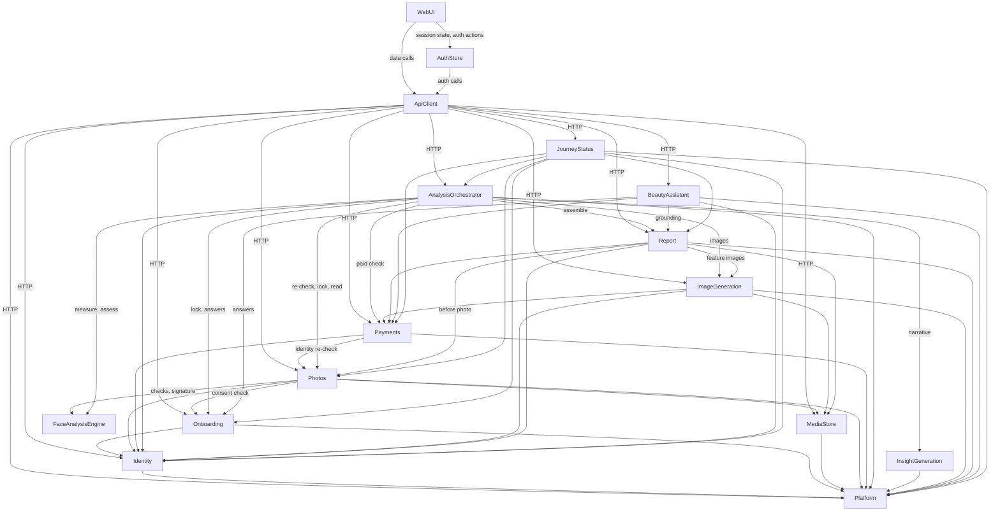

# Components — FaceIQ

## Overview

This is the component catalogue: the logical building blocks we write code for. Each block has its owned entities and its call relationships.

- **Sources:**
  - `requirements-analysis/requirements.md` (FR1–FR26, NFR1–NFR12);
  - `user-stories/stories.md` (US0.1–US9.5);
  - the affirmed `team-practices`;
  - answers Q1–Q10 in `domain-design-questions.md`.
- **Not decided here:**
  - deployment shape (one backend process or several), which is Units Generation's job;
  - column types, constraints and cardinality, which belong to Functional Design.
- **Fixed by the client:**
  - the stack: FastAPI, SQLAlchemy/Alembic and PostgreSQL on the backend; Next.js, TypeScript and Zustand on the frontend (`NFR-001`–`NFR-006`);
  - the frontend auth layering `UI → Zustand Auth Store → API Client → Backend Auth APIs → JWT/OTP Services` (`client_requirements.md` §5.3), which the frontend components below mirror one-to-one.
- **Decisions:** the full reasoning is in `decisions.md` (ADR-001 to ADR-016).

## Component Catalogue

```yaml
components:
  # ---------------- Backend ----------------
  - name: Platform
    summary: Cross-cutting backend foundation - typed settings, error envelope, request logging, rate limiting, vendor-adapter ports and factory.
    behaviour: >
      Loads all configuration through one typed settings object; secrets have no in-code default and missing
      secrets fail start-up (NFR2, project rules). Maps domain errors to one JSON error envelope with stable
      codes (401/402/403/404/409/422/429). Logs request ID and duration and redacts passwords, OTPs, tokens,
      reset tokens, Stripe signatures, photos, biometric signatures and health answers (NFR4, NFR12).
      Provides a PostgreSQL-backed rate limiter keyed per account, per IP and per user (NFR4, NFR8), and
      the config-driven factory that selects vendor adapters (email, AI text, AI image, payments, storage)
      without code changes (NFR-008, NFR-013). Exposes only non-secret public config (angle set, price, currency).
    responsibilities:
      - Typed settings and public-config endpoint
      - Error envelope and exception mapping
      - Request-ID, timing and redacted logging; health endpoint
      - Rate limiting primitive
      - Vendor adapter ports and configuration-driven factory
    depends_on: []
    dependents:
      - component: Identity
        interaction: settings, errors, logging, rate limits, email adapter
      - component: Onboarding
        interaction: settings, errors, logging
      - component: MediaStore
        interaction: settings (encryption and signing keys), storage adapter
      - component: Photos
        interaction: settings (thresholds, angle set), rate limits
      - component: Payments
        interaction: settings (price, currency), payment adapter
      - component: AnalysisOrchestrator
        interaction: settings (retry limits, timeouts), rate limits
      - component: InsightGeneration
        interaction: AI text adapter, tiering rule configuration
      - component: ImageGeneration
        interaction: AI image adapter, concurrency settings
      - component: Report
        interaction: settings, errors, logging
      - component: BeautyAssistant
        interaction: AI text adapter, daily cap, rate limits
      - component: JourneyStatus
        interaction: settings, errors
      - component: ApiClient
        interaction: public config and health endpoints over HTTP
    external_dependencies:
      - name: PostgreSQL
        kind: database
        purpose: rate-limit counters
    entities:
      - name: RateLimitCounter
        identifier: key
        attributes: [key, windowStart, count]

  - name: Identity
    summary: Custom backend-controlled authentication - signup, login, email OTP, JWT access tokens, rotating refresh sessions, password reset and change.
    behaviour: >
      Implements the backend half of the client-mandated auth layering (section 5.3) with route handlers kept free
      of token and OTP logic. Passwords are hashed with Argon2id (Q19 rules: 10-128 chars, common-password blocklist).
      OTPs are stored hashed; 10-minute expiry, 60-second resend cooldown, 5 failures then 15-minute lockout per
      account and purpose; a resend never resets a lockout (AUTH-011). Access tokens live 15 minutes with a fixed
      algorithm allow-list and a token-type claim; refresh tokens live 7 days in an httpOnly Secure cookie, rotate on
      every use, and reuse of a rotated token revokes the whole family (AUTH-010, AUTH-012). Cookie endpoints require
      X-Requested-With and an Origin/Referer allow-list (AUTH-013). Signup, login and forgot-password never reveal
      whether an email exists; unverified accounts can resume with a fresh code (Q6, Q8). Reset tokens are
      single-use, ~10 minutes, never accepted as Bearer (AUTH-015). Password change keeps the current session and
      revokes the others (AUTH-016, Q15). Provides the current-user dependency every protected endpoint uses (AUTH-007).
      No third-party auth service (AUTH-001, CON-002).
    responsibilities:
      - User accounts, verification status and role (user; admin reserved)
      - OTP issue, verify, resend, lockout
      - Token issuance, validation, refresh rotation, reuse detection, logout
      - Forgot-password and change-password flows
      - Current-user resolution for all protected endpoints
    depends_on:
      - component: Platform
        interaction: settings, error envelope, redacted logging, rate limits, email adapter
        style: sync
    dependents:
      - component: Onboarding
        interaction: resolve the authenticated user
      - component: Photos
        interaction: resolve the authenticated user
      - component: Payments
        interaction: resolve the authenticated user
      - component: AnalysisOrchestrator
        interaction: resolve the authenticated user
      - component: ImageGeneration
        interaction: resolve the authenticated user for visuals reads
      - component: Report
        interaction: resolve the authenticated user
      - component: BeautyAssistant
        interaction: resolve the authenticated user
      - component: JourneyStatus
        interaction: verification state of the user
      - component: ApiClient
        interaction: auth endpoints (register, login, OTP, refresh, logout, me, reset, change password) over HTTP
    external_dependencies:
      - name: PostgreSQL
        kind: database
        purpose: users, OTP records, refresh sessions, reset tokens
      - name: Email provider via SMTP (provider chosen during development, NFR-012)
        kind: third-party-api
        purpose: deliver OTP and account emails
    entities:
      - name: User
        identifier: id
        attributes: [id, fullName, email, passwordHash, verified, role, createdAt]
      - name: OtpRecord
        identifier: id
        attributes: [id, userId, purpose, codeHash, expiresAt, failedAttempts, lockedUntil, consumedAt, sentAt]
        references:
          - entity: User
            owned_by: Identity
            relationship: each OTP record belongs to one user
      - name: RefreshSession
        identifier: tokenId
        attributes: [tokenId, userId, familyId, parentTokenId, issuedAt, expiresAt, revokedAt]
        references:
          - entity: User
            owned_by: Identity
            relationship: each session belongs to one user
      - name: PasswordResetToken
        identifier: id
        attributes: [id, userId, tokenHash, expiresAt, usedAt]
        references:
          - entity: User
            owned_by: Identity
            relationship: each reset token belongs to one user

  - name: Onboarding
    summary: Consent capture and the 23-question branching questionnaire with its mandatory disclaimer.
    behaviour: >
      Records two consents before the questionnaire - face images plus biometric signature, and health answers,
      each covering AI-vendor sharing - with timestamp and consent-text version (FR7, Q18). Exposes a consent check
      other components use to gate uploads and health answers (403 without consent). Serves a versioned, data-driven
      questionnaire definition (content only from the pending Onboarding Questionnaire Specification), validates
      branches server-side, saves answers incrementally with resume, discards answers on abandoned branches (Q13),
      and refuses submission without the disclaimer (FR-004, BR-003). Stores each answer with its question text
      version so AI prompts can use real question text (FR-008a). Locks answers once analysis starts (US Q11).
    responsibilities:
      - Consent records and consent checks
      - Questionnaire definition, answers, branching validation, resume
      - Disclaimer enforcement
      - Input lock at analysis start
      - Providing answers (with question text) to the pipeline and assistant
    depends_on:
      - component: Identity
        interaction: resolve the authenticated user
        style: sync
      - component: Platform
        interaction: settings, errors, logging
        style: sync
    dependents:
      - component: Photos
        interaction: check image consent before accepting uploads
      - component: AnalysisOrchestrator
        interaction: read answers for the narrative; lock inputs at analysis start
      - component: BeautyAssistant
        interaction: read answers to ground chat replies
      - component: JourneyStatus
        interaction: consent and questionnaire completion state
      - component: ApiClient
        interaction: consent and questionnaire endpoints over HTTP
    external_dependencies:
      - name: PostgreSQL
        kind: database
        purpose: consents, questionnaire definitions and responses
    entities:
      - name: ConsentRecord
        identifier: id
        attributes: [id, userId, consentType, textVersion, acceptedAt]
        references:
          - entity: User
            owned_by: Identity
            relationship: each consent record belongs to one user
      - name: QuestionnaireDefinition
        identifier: version
        attributes: [version, questions, branchingRules, disclaimerTextVersion, publishedAt]
      - name: QuestionnaireResponse
        identifier: id
        attributes: [id, userId, definitionVersion, answers, disclaimerConfirmed, completedAt, lockedAt]
        references:
          - entity: User
            owned_by: Identity
            relationship: each response belongs to one user (one per user)
          - entity: QuestionnaireDefinition
            owned_by: Onboarding
            relationship: each response was answered against one definition version

  - name: MediaStore
    summary: Private storage for photos, generated images and PDFs with encryption at rest and signed owner-only links.
    behaviour: >
      Stores file bytes through the configured storage adapter (local disk now, any object store later) with
      application-level encryption at rest; raw stored bytes never equal the plaintext (NFR5.3). Never exposes a public
      URL; issues HMAC-signed, owner-bound, expiring links with a configured TTL and serves them through its own
      endpoint, refusing expired or mismatched links; link tokens are scrubbed from logs (Forbidden rules).
    responsibilities:
      - Store, read and delete encrypted files
      - Issue and verify signed owner-only links
      - File-serving endpoint
    depends_on:
      - component: Platform
        interaction: encryption and signing keys, storage adapter, logging
        style: sync
    dependents:
      - component: Photos
        interaction: store uploaded photos and issue links for review screens
      - component: ImageGeneration
        interaction: store generated images and issue links
      - component: Report
        interaction: store the cached PDF and resolve images for rendering
      - component: ApiClient
        interaction: signed-link file downloads over HTTP
    external_dependencies:
      - name: File storage (local disk now; object store later, host undecided NFR-010)
        kind: object-store
        purpose: encrypted file bytes
      - name: PostgreSQL
        kind: database
        purpose: stored-object metadata
    entities:
      - name: StoredObject
        identifier: id
        attributes: [id, ownerUserId, kind, storageKey, contentType, sizeBytes, encryptionKeyId, createdAt]
        references:
          - entity: User
            owned_by: Identity
            relationship: each stored object is owned by one user

  - name: FaceAnalysisEngine
    summary: Pure computer-vision computation - landmarks, per-photo checks, identity signature, measurements and assessments.
    behaviour: >
      Wraps MediaPipe Face Landmarker (478 points, pinned version and model hash) and OpenCV behind a thin adapter
      and exposes pure functions that take images or landmark coordinates and return numbers - owns no data (Q1).
      Per-photo checks: resolution, brightness, face count, face proportion, occlusion, pose (thresholds passed in
      from configuration, ASM-002). Identity signature: 5 landmark-distance ratios normalised by inter-eye distance
      (ASM-010). Measurements for the seven mesh-based features from the front photo, ears from their own 3/4 photo
      with front fallback (FR-007). Assessments: symmetry with Regional Balance, facial thirds, dimorphism,
      prototypicality (reference model open, OQ-S4), face-shape wireframe data (FR-018). All heuristics are first-pass
      and configurable.
    responsibilities:
      - Landmark extraction adapter
      - Per-photo quality and pose checks
      - Identity signature and pairwise comparison
      - Feature measurements and facial assessments
    depends_on: []
    dependents:
      - component: Photos
        interaction: landmarks, per-photo checks, identity signature
      - component: AnalysisOrchestrator
        interaction: measurements and assessments during analysis
    external_dependencies:
      - name: MediaPipe Face Landmarker and OpenCV (local libraries)
        kind: other
        purpose: landmark detection and image processing
    entities: []

  - name: Photos
    summary: Photo upload and replacement, per-photo validation, and the cross-photo identity check.
    behaviour: >
      Accepts uploads only with image consent and within per-user rate limits; validates by decoded content, size and
      pixel limits, re-encodes and strips EXIF/GPS before storage (FR10.3). Keeps exactly one photo per configured
      angle (FR9.4, ASM-005). Runs per-photo checks and returns stable reason codes (FR10). Once all angles pass,
      computes the identity result by match-count vote with front as the permanent reference (never flagged): row 2
      flags nothing, row 5 flags both side photos, all-different flags both side photos (BR-005, Q7); a pair at the
      threshold counts as a mismatch. Recomputes fully after each retake. Offers identity re-checks to checkout and
      analysis start (409). Persists landmarks and signatures (biometric data - never logged, owner-scoped). Locks
      photos at analysis start.
    responsibilities:
      - Photo upload, hardening, replacement
      - Per-photo validation results
      - Identity check and re-check
      - Photo input lock
      - Photo references and links for review, report and pipeline
    depends_on:
      - component: Identity
        interaction: resolve the authenticated user
        style: sync
      - component: Onboarding
        interaction: check image consent
        style: sync
      - component: MediaStore
        interaction: store photos, issue signed links
        style: sync
      - component: FaceAnalysisEngine
        interaction: landmarks, checks, identity signature
        style: sync
      - component: Platform
        interaction: thresholds, angle set, rate limits
        style: sync
    dependents:
      - component: Payments
        interaction: identity re-check before creating checkout (409)
      - component: AnalysisOrchestrator
        interaction: identity re-check at start, photo bytes and landmarks, lock
      - component: Report
        interaction: before-photo reference for report sections
      - component: JourneyStatus
        interaction: photo completeness and identity consistency
      - component: ApiClient
        interaction: upload, validation and review endpoints over HTTP
    external_dependencies:
      - name: PostgreSQL
        kind: database
        purpose: photo records and identity results
    entities:
      - name: Photo
        identifier: id
        attributes: [id, userId, angle, storedObjectId, validationStatus, validationReasons, landmarks, identitySignature, uploadedAt, lockedAt]
        references:
          - entity: User
            owned_by: Identity
            relationship: each photo belongs to one user (one per angle)
          - entity: StoredObject
            owned_by: MediaStore
            relationship: each photo's bytes are one stored object
      - name: IdentityCheckResult
        identifier: userId
        attributes: [userId, mismatchedAngles, photoIdsCompared, computedAt]
        references:
          - entity: User
            owned_by: Identity
            relationship: one current result per user
          - entity: Photo
            owned_by: Photos
            relationship: computed from the user's current photos

  - name: Payments
    summary: One-time Stripe payment per report - checkout, verified webhook confirmation, payment gate, billing history.
    behaviour: >
      Creates Stripe hosted Checkout sessions at the configured price and currency (FR-016, OQ-002) only after an
      identity re-check (409) and only if no confirmed payment exists (double-payment guard); reuses or expires open
      sessions. Confirms payment only from webhooks whose signature is verified against the raw body, processes each
      event ID once, and never downgrades a completed payment on out-of-order events; the success redirect is never
      proof of payment and the webhook never starts analysis (FR-015). Provides the is-paid check behind the 402
      payment gate for every paid route (BR-001). Serves billing history with method (brand, last 4) and receipt link,
      with PayPal shown disabled in the UI only (BR-012, Q16).
    responsibilities:
      - Checkout session creation with guards
      - Webhook verification and idempotent event processing
      - Payment status and the paid check (402 gate)
      - Billing history
    depends_on:
      - component: Identity
        interaction: resolve the authenticated user
        style: sync
      - component: Photos
        interaction: identity re-check before checkout
        style: sync
      - component: Platform
        interaction: price, currency, payment adapter, logging
        style: sync
    dependents:
      - component: AnalysisOrchestrator
        interaction: paid check before starting analysis
      - component: ImageGeneration
        interaction: paid check for visuals reads
      - component: Report
        interaction: paid check for report, PDF and home reads
      - component: BeautyAssistant
        interaction: paid check for chat
      - component: JourneyStatus
        interaction: payment state
      - component: ApiClient
        interaction: checkout, payment status and billing endpoints over HTTP
    external_dependencies:
      - name: Stripe (hosted Checkout and webhooks)
        kind: third-party-api
        purpose: take and confirm the one-time payment
      - name: PostgreSQL
        kind: database
        purpose: payments and processed webhook events
    entities:
      - name: Payment
        identifier: id
        attributes: [id, userId, stripeSessionId, status, amount, currency, cardBrand, cardLast4, receiptUrl, createdAt, paidAt]
        references:
          - entity: User
            owned_by: Identity
            relationship: each payment belongs to one user
      - name: StripeEventRecord
        identifier: stripeEventId
        attributes: [stripeEventId, eventType, paymentId, processedAt]
        references:
          - entity: Payment
            owned_by: Payments
            relationship: each processed event updates at most one payment

  - name: AnalysisOrchestrator
    summary: Runs the paid analysis as a resumable background job and owns the analysis result.
    behaviour: >
      Starts analysis only on an explicit confirmed user action, after re-checking payment (402) and identity (409),
      with a single-running-job guard and per-user rate limit (FR-015, FR13). Locks photos and answers at start.
      Executes an ordered registry of idempotent steps in a separate worker process - measurement, narrative,
      assessments, feature images, visuals, report assembly - calling each component's public interface directly
      (no event bus, Q7). Retries each step a configurable number of times with per-step timeouts, keeps completed
      steps, and resumes from the failed step on "Try again" without any second payment (FR13.4, NFR7). Records
      per-step durations for the 10-minute p95 target (NFR3.1). Owns the analysis result (DATA-006).
    responsibilities:
      - Start analysis with guards and input lock
      - Job and step lifecycle, leases, retries, timeouts, resume
      - Step registry and execution order
      - Analysis result (measurements, assessments, narratives, recommendations)
      - Job status for the progress screen
    depends_on:
      - component: Identity
        interaction: resolve the authenticated user
        style: sync
      - component: Payments
        interaction: paid check before start
        style: sync
      - component: Photos
        interaction: identity re-check, lock photos, read photo bytes and landmarks
        style: sync
      - component: Onboarding
        interaction: lock answers, read answers with question text
        style: sync
      - component: FaceAnalysisEngine
        interaction: measurements and assessments
        style: sync
      - component: InsightGeneration
        interaction: narrative, closing recommendations and tiering
        style: sync
      - component: ImageGeneration
        interaction: generate feature images and visuals
        style: sync
      - component: Report
        interaction: assemble and publish the report from the analysis result
        style: sync
      - component: Platform
        interaction: retry limits, timeouts, rate limits, logging
        style: sync
    dependents:
      - component: JourneyStatus
        interaction: analysis in progress, failed or complete
      - component: ApiClient
        interaction: start, status and resume endpoints over HTTP
    external_dependencies:
      - name: PostgreSQL
        kind: database
        purpose: job, step and analysis-result tables; worker claim via row locking
    entities:
      - name: AnalysisJob
        identifier: id
        attributes: [id, userId, status, currentStep, startedAt, finishedAt, failedStep]
        references:
          - entity: User
            owned_by: Identity
            relationship: each job belongs to one user (one successful job per user)
      - name: JobStep
        identifier: id
        attributes: [id, jobId, name, status, attempts, leaseUntil, durationMs, lastErrorCode]
        references:
          - entity: AnalysisJob
            owned_by: AnalysisOrchestrator
            relationship: each step belongs to one job
      - name: AnalysisResult
        identifier: id
        attributes: [id, userId, jobId, measurements, assessments, narratives, recommendations, closingRecommendations, createdAt]
        references:
          - entity: User
            owned_by: Identity
            relationship: one analysis result per user
          - entity: AnalysisJob
            owned_by: AnalysisOrchestrator
            relationship: produced by one job

  - name: InsightGeneration
    summary: AI narrative per feature, closing recommendations and recommendation tiering.
    behaviour: >
      Builds the multimodal prompt from photos, measurements and questionnaire answers with their real question text;
      excludes medical, medication and allergy answers from cosmetic context; adds the reassuring-tone instruction when
      the configurable elevated-distress rule matches (FR-008 a-f). Calls the configured AI text vendor (base URL, key,
      model from configuration, NFR-008) and validates structured output - all 11 features, 3-5 sentences each, a cited
      measurement where one exists, and closing recommendations - failing the step otherwise. Sorts recommendations into
      at-home, OTC/skincare and in-clinic tiers with a replaceable keyword rule set (default tier at-home, precedence
      in-clinic > OTC > at-home, ASM-007 unconfirmed) and always adds "consult a qualified professional" language.
      Stateless: returns results to the orchestrator.
    responsibilities:
      - Prompt building and safety/tone rules
      - AI text call and output validation
      - Recommendation tiering
    depends_on:
      - component: Platform
        interaction: AI text adapter, tiering rules and distress rule configuration
        style: sync
    dependents:
      - component: AnalysisOrchestrator
        interaction: narrative step
    external_dependencies:
      - name: OpenAI gpt-4o (Vision + GPT), swappable by configuration
        kind: third-party-api
        purpose: narrative and recommendations
    entities: []

  - name: ImageGeneration
    summary: AI "after" images for the 11 features and the 13 AI Visuals images, plus visuals reads.
    behaviour: >
      Generates one identity-preserving "after" image per report feature (11) and 5 hairstyle, 5 outfit and 3
      healthy-aging images (+3, +5, +10 years; "current" is the user's own photo) - 24 per report (FR-020, FR-022). Uses
      the swappable image adapter (OpenAI gpt-image-1 edit with high input fidelity by default, NFR-013) with
      per-image idempotent sub-steps, bounded concurrency and bounded back-off on vendor 429; a retry generates only
      missing images and nothing is regenerated on user request (NFR8). Stores images via MediaStore. Serves AI Visuals
      reads to the owner after the paid check.
    responsibilities:
      - Feature "after" images
      - AI Visuals images
      - Visuals read endpoint
    depends_on:
      - component: MediaStore
        interaction: store images, issue signed links
        style: sync
      - component: Identity
        interaction: resolve the authenticated user for reads
        style: sync
      - component: Payments
        interaction: paid check for reads
        style: sync
      - component: Platform
        interaction: AI image adapter, concurrency and retry settings
        style: sync
    dependents:
      - component: AnalysisOrchestrator
        interaction: image and visuals steps
      - component: Report
        interaction: feature image references for sections and PDF
      - component: ApiClient
        interaction: AI Visuals read endpoint over HTTP
    external_dependencies:
      - name: OpenAI gpt-image-1 (swappable, e.g. Gemini 2.5 Flash Image)
        kind: third-party-api
        purpose: image editing
      - name: PostgreSQL
        kind: database
        purpose: image records
    entities:
      - name: ReportFeatureVisual
        identifier: id
        attributes: [id, analysisResultId, feature, storedObjectId, status, attempts]
        references:
          - entity: AnalysisResult
            owned_by: AnalysisOrchestrator
            relationship: each feature image belongs to one analysis result
          - entity: StoredObject
            owned_by: MediaStore
            relationship: image bytes are one stored object
      - name: AiVisualAsset
        identifier: id
        attributes: [id, analysisResultId, category, variant, storedObjectId, status, attempts]
        references:
          - entity: AnalysisResult
            owned_by: AnalysisOrchestrator
            relationship: each visual belongs to one analysis result
          - entity: StoredObject
            owned_by: MediaStore
            relationship: image bytes are one stored object

  - name: Report
    summary: Report assembly and auto-publish, report reads, PDF generation and cache, Home Overview summary.
    behaviour: >
      Assembles the report from the analysis result handed over by the orchestrator - exactly 11 feature sections with
      Smile content under Lips, static branded intro/preamble/limitations copy, AI closing recommendations - and stores a
      content snapshot so later reads never call back into the orchestrator (FR-009, FR-011, BR-008, BR-011).
      Publishes immediately with no review step; one report per user; a failed assembly publishes nothing (BR-002,
      FR-014). Serves report and Home Overview reads to the owner after the paid check; AI text is returned as plain text
      for text-only rendering. Generates the branded PDF on first download, caches it via MediaStore (FR-013).
      Content still pending the Report & UI Specification (key stats, protocol summary, priority features, radar axes,
      label sets) is treated as configurable and not assumed.
    responsibilities:
      - Report assembly and publish
      - Report and Home Overview reads
      - PDF rendering and cache
    depends_on:
      - component: Identity
        interaction: resolve the authenticated user
        style: sync
      - component: Payments
        interaction: paid check for reads
        style: sync
      - component: Photos
        interaction: before-photo reference
        style: sync
      - component: ImageGeneration
        interaction: feature image references
        style: sync
      - component: MediaStore
        interaction: store PDF, resolve images for rendering, issue links
        style: sync
      - component: Platform
        interaction: settings, errors, logging
        style: sync
    dependents:
      - component: AnalysisOrchestrator
        interaction: assemble and publish step
      - component: BeautyAssistant
        interaction: report content to ground chat replies
      - component: JourneyStatus
        interaction: report published state
      - component: ApiClient
        interaction: report, home and PDF endpoints over HTTP
    external_dependencies:
      - name: PostgreSQL
        kind: database
        purpose: reports
      - name: HTML-to-PDF renderer (Proposed ADR-014)
        kind: other
        purpose: PDF generation
    entities:
      - name: Report
        identifier: id
        attributes: [id, userId, analysisResultId, sections, status, publishedAt, pdfStoredObjectId]
        references:
          - entity: User
            owned_by: Identity
            relationship: one report per user
          - entity: AnalysisResult
            owned_by: AnalysisOrchestrator
            relationship: each report is built from exactly one analysis result
          - entity: StoredObject
            owned_by: MediaStore
            relationship: the cached PDF is one stored object

  - name: BeautyAssistant
    summary: Chat about the user's own report, grounded in their data, declining medical questions, with a daily cap.
    behaviour: >
      Builds grounding context only from the requesting user's report content and questionnaire answers (medical,
      medication and allergy answers excluded where FR15.4 applies). The system prompt always contains the rule to
      decline medical and medication questions kindly and redirect to a qualified professional (FR-019). Enforces a
      configurable daily message cap per user that resets at midnight UTC; failed replies do not count (Q17). Rejects
      empty or over-long messages (422). Keeps conversation history. Replies are non-streaming (Proposed ADR-016) and
      returned as plain text.
    responsibilities:
      - Conversations and messages
      - Grounded replies and medical decline rule
      - Daily cap and chat rate limit
    depends_on:
      - component: Identity
        interaction: resolve the authenticated user
        style: sync
      - component: Payments
        interaction: paid check
        style: sync
      - component: Report
        interaction: report content for grounding
        style: sync
      - component: Onboarding
        interaction: questionnaire answers for grounding
        style: sync
      - component: Platform
        interaction: AI text adapter, cap setting, rate limits
        style: sync
    dependents:
      - component: ApiClient
        interaction: chat endpoints over HTTP
    external_dependencies:
      - name: OpenAI gpt-4o (swappable by configuration)
        kind: third-party-api
        purpose: chat replies
      - name: PostgreSQL
        kind: database
        purpose: conversations, messages, daily usage
    entities:
      - name: ChatConversation
        identifier: id
        attributes: [id, userId, reportId, createdAt]
        references:
          - entity: User
            owned_by: Identity
            relationship: each conversation belongs to one user
          - entity: Report
            owned_by: Report
            relationship: each conversation is about one report
      - name: ChatMessage
        identifier: id
        attributes: [id, conversationId, role, content, status, createdAt]
        references:
          - entity: ChatConversation
            owned_by: BeautyAssistant
            relationship: each message belongs to one conversation
      - name: ChatDailyUsage
        identifier: userIdAndDate
        attributes: [userId, usageDate, messageCount]
        references:
          - entity: User
            owned_by: Identity
            relationship: one usage counter per user per UTC day

  - name: JourneyStatus
    summary: Read-only computation of the user's next step for entry-point routing.
    behaviour: >
      Returns the first incomplete step in the order verification -> consent -> questionnaire -> photos (an
      identity-inconsistent set is incomplete) -> payment -> start analysis -> in progress / failed -> home, by asking
      each owning component through its public interface. Owns no data (Q5). Once a report is published, direct
      links to post-analysis routes are honoured (FR26).
    responsibilities:
      - Next-step computation for routing guards
    depends_on:
      - component: Identity
        interaction: verification state
        style: sync
      - component: Onboarding
        interaction: consent and questionnaire state
        style: sync
      - component: Photos
        interaction: photo completeness and identity consistency
        style: sync
      - component: Payments
        interaction: payment state
        style: sync
      - component: AnalysisOrchestrator
        interaction: analysis state
        style: sync
      - component: Report
        interaction: report published state
        style: sync
      - component: Platform
        interaction: errors and logging
        style: sync
    dependents:
      - component: ApiClient
        interaction: journey-status endpoint over HTTP
    entities: []

  # ---------------- Frontend ----------------
  - name: WebUI
    summary: Next.js screens and presentational components for the whole journey, with no direct token or auth-API access.
    behaviour: >
      Renders landing, auth, consent, questionnaire, photo capture and review, payment, progress, report, home, AI
      Visuals, chat and settings screens; applies routing guards from the auth store's session state and the
      journey status; uses shared toast and confirmation components (BR-009, BR-010) and meets WCAG 2.1 AA (NFR6).
      Never calls auth APIs, never reads tokens (FE-007); non-auth data goes through the API client; AI text is
      rendered as text only.
    responsibilities:
      - Screens, forms and presentational components
      - Client-side route guards
      - Shared feedback and confirmation components
    depends_on:
      - component: AuthStore
        interaction: session state, login/logout/register actions
        style: sync
      - component: ApiClient
        interaction: non-auth data calls (onboarding, photos, payments, analysis, report, visuals, chat, journey)
        style: sync
    dependents: []
    entities: []

  - name: AuthStore
    summary: Zustand auth store - the single frontend source of auth state; holds user and access token in memory only.
    behaviour: >
      Holds the current user, the in-memory access token and an initializing flag; never uses persist, never writes
      localStorage or sessionStorage; never holds the refresh token (FE-001, FE-002, FE-003). Runs session restore on
      app start (refresh then me), exposes login, OTP, logout and register actions that call auth endpoints through the
      API client, and registers itself with the API client as its token provider and session-ended handler.
    responsibilities:
      - Auth state and session restore
      - Auth actions via the API client
    depends_on:
      - component: ApiClient
        interaction: auth endpoint calls; registers token provider and session callbacks
        style: sync
    dependents:
      - component: WebUI
        interaction: reads session state and triggers auth actions
    entities: []

  - name: ApiClient
    summary: The only HTTP caller - attaches the access token, sends cookies, refreshes proactively and on 401 (single-flight).
    behaviour: >
      Sends every backend request with credentials included and the access token from an injected token provider;
      refreshes about 60 seconds before expiry and on 401 with one shared in-flight refresh, retrying each request once;
      clears the session (through the injected callback) only when refresh returns 401, never on network errors or 5xx
      (FE-004, FE-005, FE-006). Adds X-Requested-With on cookie endpoints. Maps the error envelope to typed errors and toast
      copy. Uses API types generated from the backend OpenAPI schema.
    responsibilities:
      - HTTP transport, auth header, cookies
      - Proactive and reactive refresh (single-flight)
      - Error mapping
    depends_on:
      - component: Identity
        interaction: auth endpoints
        style: sync
      - component: Onboarding
        interaction: consent and questionnaire endpoints
        style: sync
      - component: Photos
        interaction: upload, validation, review endpoints
        style: sync
      - component: MediaStore
        interaction: signed-link file reads
        style: sync
      - component: Payments
        interaction: checkout, status, billing endpoints
        style: sync
      - component: AnalysisOrchestrator
        interaction: start, status, resume endpoints
        style: sync
      - component: ImageGeneration
        interaction: AI Visuals endpoint
        style: sync
      - component: Report
        interaction: report, home, PDF endpoints
        style: sync
      - component: BeautyAssistant
        interaction: chat endpoints
        style: sync
      - component: JourneyStatus
        interaction: journey-status endpoint
        style: sync
      - component: Platform
        interaction: public config and health endpoints
        style: sync
    dependents:
      - component: WebUI
        interaction: non-auth data calls
      - component: AuthStore
        interaction: auth calls
    entities: []
```

## Component Diagram



<!-- Text fallback: Frontend: WebUI calls AuthStore and ApiClient; AuthStore calls ApiClient; ApiClient calls every backend component over HTTP. Backend: Platform is the base everything depends on. Identity depends on Platform. Onboarding depends on Identity. MediaStore depends on Platform. Photos depends on Identity, Onboarding, MediaStore, FaceAnalysisEngine. Payments depends on Identity and Photos. AnalysisOrchestrator depends on Identity, Payments, Photos, Onboarding, FaceAnalysisEngine, InsightGeneration, ImageGeneration, Report. ImageGeneration depends on MediaStore, Identity, Payments. Report depends on Identity, Payments, Photos, ImageGeneration, MediaStore. BeautyAssistant depends on Identity, Payments, Report, Onboarding. JourneyStatus depends on Identity, Onboarding, Photos, Payments, AnalysisOrchestrator, Report. The graph is acyclic. -->

## Component Summary

| Component | Purpose | Depends On | Dependents | Entities Owned |
|-----------|---------|------------|------------|----------------|
| Platform | Settings, errors, logging, rate limits, adapter factory | — | all backend components except FaceAnalysisEngine; ApiClient | RateLimitCounter |
| Identity | Custom auth: signup, OTP, tokens, sessions, reset, change password | Platform | Onboarding, Photos, Payments, AnalysisOrchestrator, ImageGeneration, Report, BeautyAssistant, JourneyStatus, ApiClient | User, OtpRecord, RefreshSession, PasswordResetToken |
| Onboarding | Consent, questionnaire, disclaimer, input lock | Identity, Platform | Photos, AnalysisOrchestrator, BeautyAssistant, JourneyStatus, ApiClient | ConsentRecord, QuestionnaireDefinition, QuestionnaireResponse |
| MediaStore | Encrypted private files, signed links | Platform | Photos, ImageGeneration, Report, ApiClient | StoredObject |
| FaceAnalysisEngine | Pure CV computation | — | Photos, AnalysisOrchestrator | — |
| Photos | Upload, validation, identity check, lock | Identity, Onboarding, MediaStore, FaceAnalysisEngine, Platform | Payments, AnalysisOrchestrator, Report, JourneyStatus, ApiClient | Photo, IdentityCheckResult |
| Payments | Checkout, webhook, 402 gate, billing | Identity, Photos, Platform | AnalysisOrchestrator, ImageGeneration, Report, BeautyAssistant, JourneyStatus, ApiClient | Payment, StripeEventRecord |
| AnalysisOrchestrator | Background analysis job and result | Identity, Payments, Photos, Onboarding, FaceAnalysisEngine, InsightGeneration, ImageGeneration, Report, Platform | JourneyStatus, ApiClient | AnalysisJob, JobStep, AnalysisResult |
| InsightGeneration | AI narrative, closing recommendations, tiering | Platform | AnalysisOrchestrator | — |
| ImageGeneration | 11 feature images, 13 visuals, visuals reads | MediaStore, Identity, Payments, Platform | AnalysisOrchestrator, Report, ApiClient | ReportFeatureVisual, AiVisualAsset |
| Report | Assembly, publish, reads, PDF, Home | Identity, Payments, Photos, ImageGeneration, MediaStore, Platform | AnalysisOrchestrator, BeautyAssistant, JourneyStatus, ApiClient | Report |
| BeautyAssistant | Grounded chat, medical decline, daily cap | Identity, Payments, Report, Onboarding, Platform | ApiClient | ChatConversation, ChatMessage, ChatDailyUsage |
| JourneyStatus | Next-step routing | Identity, Onboarding, Photos, Payments, AnalysisOrchestrator, Report, Platform | ApiClient | — |
| WebUI | Screens, guards, shared feedback | AuthStore, ApiClient | — | — |
| AuthStore | In-memory auth state and actions | ApiClient | WebUI | — |
| ApiClient | Only HTTP caller, refresh logic | all backend components with endpoints | WebUI, AuthStore | — |

## Entity Ownership

| Entity | Owning Component | Identifier | Attributes | References |
|--------|------------------|------------|------------|------------|
| RateLimitCounter | Platform | key | key, windowStart, count | — |
| User (DATA-001) | Identity | id | fullName, email, passwordHash, verified, role, createdAt | — |
| OtpRecord (DATA-002) | Identity | id | userId, purpose, codeHash, expiresAt, failedAttempts, lockedUntil, consumedAt, sentAt | User |
| RefreshSession (DATA-003) | Identity | tokenId | userId, familyId, parentTokenId, issuedAt, expiresAt, revokedAt | User |
| PasswordResetToken | Identity | id | userId, tokenHash, expiresAt, usedAt | User |
| ConsentRecord | Onboarding | id | userId, consentType, textVersion, acceptedAt | User |
| QuestionnaireDefinition | Onboarding | version | questions, branchingRules, disclaimerTextVersion, publishedAt | — |
| QuestionnaireResponse (DATA-004) | Onboarding | id | userId, definitionVersion, answers, disclaimerConfirmed, completedAt, lockedAt | User, QuestionnaireDefinition |
| StoredObject | MediaStore | id | ownerUserId, kind, storageKey, contentType, sizeBytes, encryptionKeyId, createdAt | User |
| Photo (DATA-005) | Photos | id | userId, angle, storedObjectId, validationStatus, validationReasons, landmarks, identitySignature, uploadedAt, lockedAt | User, StoredObject |
| IdentityCheckResult | Photos | userId | mismatchedAngles, photoIdsCompared, computedAt | User, Photo |
| Payment (DATA-008) | Payments | id | userId, stripeSessionId, status, amount, currency, cardBrand, cardLast4, receiptUrl, createdAt, paidAt | User |
| StripeEventRecord | Payments | stripeEventId | eventType, paymentId, processedAt | Payment |
| AnalysisJob | AnalysisOrchestrator | id | userId, status, currentStep, startedAt, finishedAt, failedStep | User |
| JobStep | AnalysisOrchestrator | id | jobId, name, status, attempts, leaseUntil, durationMs, lastErrorCode | AnalysisJob |
| AnalysisResult (DATA-006) | AnalysisOrchestrator | id | userId, jobId, measurements, assessments, narratives, recommendations, closingRecommendations, createdAt | User, AnalysisJob |
| ReportFeatureVisual (DATA-009) | ImageGeneration | id | analysisResultId, feature, storedObjectId, status, attempts | AnalysisResult, StoredObject |
| AiVisualAsset (DATA-010) | ImageGeneration | id | analysisResultId, category, variant, storedObjectId, status, attempts | AnalysisResult, StoredObject |
| Report (DATA-007) | Report | id | userId, analysisResultId, sections, status, publishedAt, pdfStoredObjectId | User, AnalysisResult, StoredObject |
| ChatConversation (DATA-011) | BeautyAssistant | id | userId, reportId, createdAt | User, Report |
| ChatMessage (DATA-011) | BeautyAssistant | id | conversationId, role, content, status, createdAt | ChatConversation |
| ChatDailyUsage | BeautyAssistant | userIdAndDate | userId, usageDate, messageCount | User |

## External Dependencies

| Component | Dependency | Kind | Purpose |
|-----------|------------|------|---------|
| Platform | PostgreSQL | database | Rate-limit counters |
| Identity | PostgreSQL | database | Users, OTPs, sessions, reset tokens |
| Identity | Email provider via SMTP (NFR-012) | third-party-api | OTP and account emails (Mailpit locally) |
| Onboarding | PostgreSQL | database | Consents, questionnaire |
| MediaStore | File storage (local disk now; object store later) | object-store | Encrypted file bytes |
| MediaStore | PostgreSQL | database | Stored-object metadata |
| FaceAnalysisEngine | MediaPipe Face Landmarker, OpenCV | other | Landmarks and image processing |
| Photos | PostgreSQL | database | Photos, identity results |
| Payments | Stripe | third-party-api | Hosted Checkout, webhooks |
| Payments | PostgreSQL | database | Payments, processed events |
| AnalysisOrchestrator | PostgreSQL | database | Jobs, steps, analysis results, worker claims |
| InsightGeneration | OpenAI gpt-4o (swappable) | third-party-api | Narrative and recommendations |
| ImageGeneration | OpenAI gpt-image-1 (swappable) | third-party-api | Image editing |
| ImageGeneration | PostgreSQL | database | Image records |
| Report | PostgreSQL | database | Reports |
| Report | HTML-to-PDF renderer (Proposed ADR-014) | other | PDF generation |
| BeautyAssistant | OpenAI gpt-4o (swappable) | third-party-api | Chat replies |
| BeautyAssistant | PostgreSQL | database | Conversations, messages, usage |

## Rationale

| Component | Why it is a separate building block |
|-----------|-------------------------------------|
| Platform | Cross-cutting concern; changes rarely; must not depend on any domain component (ADR-010) |
| Identity | Distinct security concern with the strictest rules and 90% coverage floor; client mandates backend-owned auth (ADR-001) |
| Onboarding | Pre-analysis user inputs that change together with the pending Onboarding Questionnaire Specification (ADR-003) |
| MediaStore | One place for the privacy rules on biometric images: encryption, no public URLs, signed links (ADR-007) |
| FaceAnalysisEngine | Pure computation with a heavy native dependency; testable with landmark fixtures; changes with CV tuning, not with product flows (ADR-002) |
| Photos | Owns the photo lifecycle and the identity vote, a tests-first rule with 409 re-checks (ADR-001) |
| Payments | Revenue-critical gate with its own vendor and webhook lifecycle (ADR-001) |
| AnalysisOrchestrator | Long-running, resumable workflow with a different runtime model (background worker) from request handlers (ADR-008) |
| InsightGeneration | Changes with prompt, tone and safety rules and the text vendor (ADR-004) |
| ImageGeneration | Changes with the image vendor, cost and concurrency; separate data (24 images per report) (ADR-004) |
| Report | Owns the published artifact and its derived views and PDF; a snapshot breaks the cycle with the orchestrator (ADR-005) |
| BeautyAssistant | Interactive, rate-capped feature with its own safety rule and data (ADR-001) |
| JourneyStatus | One routing rule across six owners, with no data of its own (ADR-006) |
| WebUI, AuthStore, ApiClient | Mirror the client-mandated frontend layering; token handling isolated from UI (ADR-009) |

**Deliberate design notes:**
- **No dependency cycles.**
  - ApiClient ↔ AuthStore is avoided by injecting a token provider and session callbacks into ApiClient (ADR-009).
  - AnalysisOrchestrator ↔ Report is avoided by passing the analysis result into assembly and storing a snapshot (ADR-005).
  - Input locks are set by the orchestrator on Onboarding and Photos, so neither needs to call back (ADR-012).
- **Alternatives rejected:**
  - A coarse five-component split: Auth, Onboarding, Analysis, Report, Chat (ADR-001).
  - A single AI component (ADR-004).
  - An engine that owns its results (ADR-002).
  - Per-component file storage (ADR-007).
  - An event bus (ADR-008).
  - A single frontend component (ADR-009).
