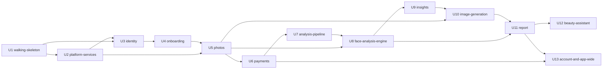

# Unit of Work Dependencies — FaceIQ

## Overview

This document describes the dependency graph between the 13 units defined in `unit-of-work.md`. Each edge "A depends on B" means A cannot finish, meaning pass its acceptance criteria, until B's delivered interfaces exist.

- **Source of the edges:** the story-level dependencies in `user-stories/stories.md` and the component dependencies in `domain-design/components.md`, aggregated to unit level.
- **Order:** this is topology only. The build order and critical path are chosen in Delivery Planning.

## Dependency Edges

```yaml
units:
  - name: u1-walking-skeleton
    kind: service
    depends_on: []
  - name: u2-platform-services
    kind: library
    depends_on: [u1-walking-skeleton]
  - name: u3-identity
    kind: service
    depends_on: [u1-walking-skeleton, u2-platform-services]
  - name: u4-onboarding
    kind: service
    depends_on: [u3-identity]
  - name: u5-photos
    kind: service
    depends_on: [u2-platform-services, u4-onboarding]
  - name: u6-payments
    kind: service
    depends_on: [u5-photos]
  - name: u7-analysis-pipeline
    kind: service
    depends_on: [u6-payments]
  - name: u8-face-analysis-engine
    kind: library
    depends_on: [u5-photos, u7-analysis-pipeline]
  - name: u9-insights
    kind: library
    depends_on: [u8-face-analysis-engine]
  - name: u10-image-generation
    kind: service
    depends_on: [u5-photos, u9-insights]
  - name: u11-report
    kind: service
    depends_on: [u8-face-analysis-engine, u10-image-generation]
  - name: u12-beauty-assistant
    kind: service
    depends_on: [u11-report]
  - name: u13-account-and-app-wide
    kind: ui
    depends_on: [u6-payments, u11-report]
```

## Dependency Graph



<!-- Text fallback: arrows point from a prerequisite to the unit that depends on it. U1 has no prerequisites. U2 needs U1. U3 needs U1 and U2. U4 needs U3. U5 needs U2 and U4. U6 needs U5. U7 needs U6. U8 needs U5 and U7. U9 needs U8. U10 needs U5 and U9. U11 needs U8 and U10. U12 needs U11. U13 needs U6 and U11. The graph has no cycles. -->

## Edge Justification

| Unit | Depends on | Why (story or component link) |
|------|------------|-------------------------------|
| U2 | U1 | US0.2 extends the core CI (US0.1); US0.7–US0.9 build on the backend foundation (US0.3) |
| U3 | U1, U2 | US1.2 extends the skeleton login (US0.6) and needs adapters (US0.7) and rate limits (US0.8) |
| U4 | U3 | US2.1 needs session restore and protected routes (US1.8) |
| U5 | U2, U4 | US3.1 follows the disclaimer (US2.4); US3.2 needs the image consent check (US2.1), adapters and limits (US0.7, US0.8) |
| U6 | U5 | US4.1 needs onboarding routing (US3.9) and the identity re-check (FR11.5) |
| U7 | U6 | US5.1 needs the payment gate (US4.3) |
| U8 | U5, U7 | Measurements reuse the MediaPipe adapter and persisted landmarks (US3.5) and register steps in the pipeline (US5.1) |
| U9 | U8 | The narrative (US5.6) consumes measurements (US5.5) |
| U10 | U5, U9 | Feature images follow the narrative (US5.10 needs US5.6); visuals reads use signed links (US3.4) |
| U11 | U8, U10 | Assembly needs assessments (US5.9), tiering (US5.7, via U9 through U10), and all images (US5.10, US5.11) |
| U12 | U11 | Chat is grounded in the published report (US7.3 needs US6.1) |
| U13 | U6, U11 | Billing needs confirmed payments (US8.3 needs US4.2); post-payment routing and the audit need the report and Home (US9.2, US9.4) |

## Integration Points

| From | To | Mechanism | What crosses the boundary |
|------|----|-----------|---------------------------|
| Frontend (all units) | Backend (all units) | HTTP/JSON over CORS with credentials; API types generated from OpenAPI | Every endpoint; formalised in Contract Design |
| U4 Onboarding | U5 Photos | In-process interface | Image-consent check |
| U5 Photos | U6 Payments, U7 Pipeline | In-process interface | Identity re-check result (409), photo bytes and landmarks, input lock |
| U4 Onboarding | U7 Pipeline, U9, U12 | In-process interface | Answers with question text; input lock |
| U6 Payments | U7, U10, U11, U12 | In-process interface | Paid check (402 gate) |
| U7 Pipeline | U8, U9, U10, U11 | Step registry in the worker | Step contracts: inputs are the analysis context; outputs are written to AnalysisResult or owner tables |
| U5 MediaStore | U10, U11 | In-process interface | Store encrypted files, issue signed links |
| U11 Report | U12 Assistant | In-process interface | Report content snapshot for grounding |
| Backend | PostgreSQL | SQLAlchemy/Alembic | Each unit owns its tables, and migrations are per unit |
| Backend | Vendors | Adapters (ADR-011) | Email (U3), Stripe (U6), OpenAI text (U9), OpenAI image (U10), storage (U5) |

## Parallel Development Opportunities

These sets of units have no dependency between them and can be built at the same time once their prerequisites are done (Q4):
- **U12 and U13:** both need only U11 (and U6), and have no edge between them.
- **Early work in U8 and U9:** the pure measurement functions and the prompt builder can be developed against landmark fixtures and recorded responses while U5–U7 are in progress. The units can only finish once their dependencies exist.
- **U2 and U3:** U2's security gates (US0.2) and seeding (US0.9) are independent of U3. U3 only waits for U2's adapters and rate limiter (US0.7, US0.8).

Many valid topological orders exist. Choosing among them is left to Delivery Planning.

## Walking Skeleton

- **U1 u1-walking-skeleton** is the first unit in the DAG, because it has no dependencies. It is the integrated slice required by the affirmed Walking Skeleton practice.
- **What runs:** the login step goes end to end, from the Next.js login form through the Zustand store and the API client, across CORS, to the FastAPI auth route and service and PostgreSQL. It returns "OTP required".
- **How to verify it:** one documented local command starts all services (US0.4) and runs the Playwright skeleton test (US0.6).
- **Why it can run first:** it needs no email, OTP, payment or AI component, so no later unit is required.
